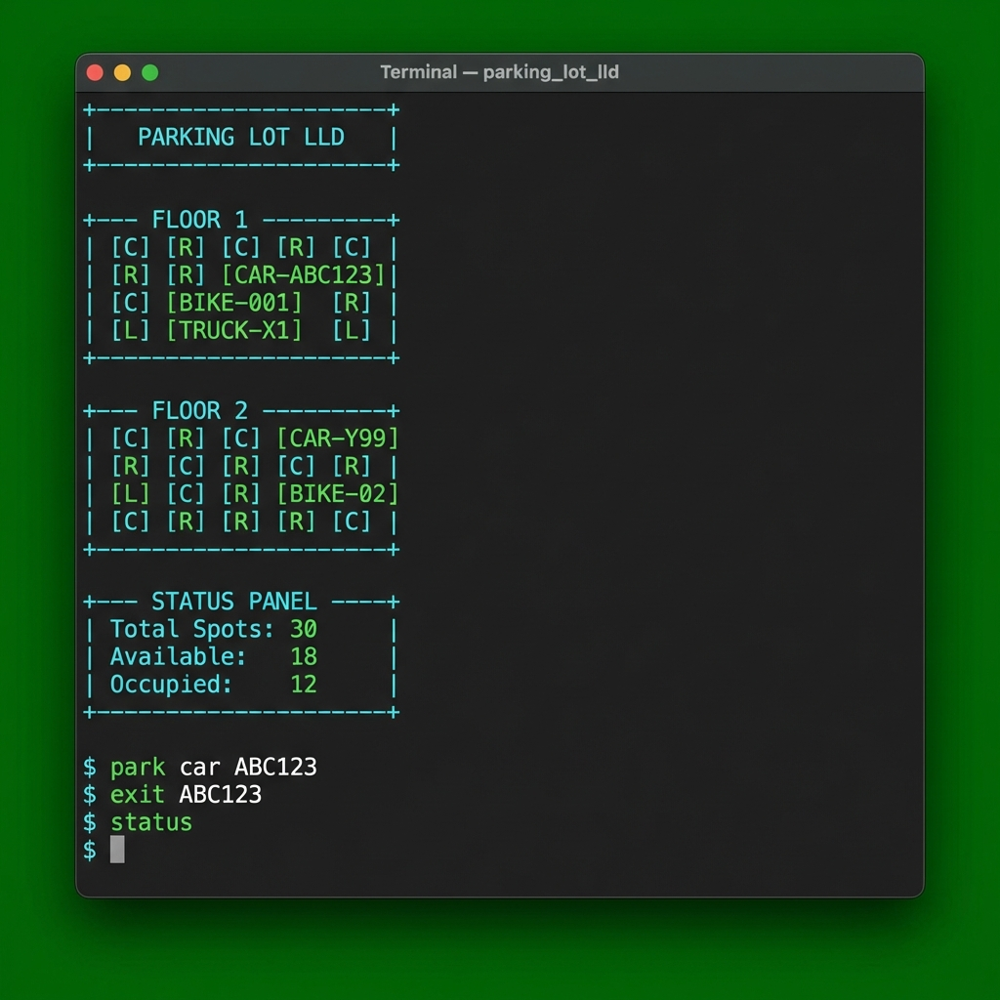

# Parking Lot LLD - Interview Solution

## 🖥️ Expected UI



---

## 📋 Interview Flow (30-40 mins)

### Phase 1: Requirements (2-3 mins)
- Multi-floor parking lot
- Vehicle types: Bike, Car, Truck
- Different spot sizes (Compact, Regular, Large)
- Pricing: Hourly / Daily
- Allocation: Near Entrance / Near Elevator

### Phase 2: High-Level Design (5 mins)
```
ParkingLot (Singleton)
     │
     ├── ParkingFloor[] ─── contains ──► ParkingSpot[]
     │                                      ├── Compact (Bike)
     │                                      ├── Regular (Car)
     │                                      └── Large (Truck)
     │
     ├── VehicleFactory (Factory Pattern)
     │
     ├── PricingStrategy (Strategy Pattern)
     │      ├── HourlyPricing
     │      └── DailyPricing
     │
     └── ParkingStrategy (Strategy Pattern)
            ├── NearEntranceStrategy
            └── NearElevatorStrategy
```

---

## 🏗️ Design Patterns Used

| Pattern | Class | Purpose |
|---------|-------|---------|
| **Singleton** | `ParkingLot` | Single parking lot instance |
| **Factory** | `VehicleFactory` | Create vehicles by type |
| **Strategy** | `PricingStrategy` | Interchangeable pricing algorithms |
| **Strategy** | `ParkingStrategy` | Interchangeable spot allocation |

---

## 📁 Project Structure

```
parkinglot/
├── Main.java              # Interactive console
├── Demo.java              # Auto-running demo
├── enums/
│   ├── VehicleType.java   # BIKE, CAR, TRUCK
│   └── SpotType.java      # COMPACT, REGULAR, LARGE
├── model/
│   ├── Vehicle.java       # License plate + type
│   ├── ParkingSpot.java   # Spot with distances
│   ├── ParkingFloor.java  # Collection of spots
│   └── Ticket.java        # Entry/exit tracking
├── factory/
│   └── VehicleFactory.java
├── strategy/
│   ├── PricingStrategy.java     # Interface
│   ├── HourlyPricing.java
│   ├── DailyPricing.java
│   ├── ParkingStrategy.java     # Interface
│   ├── NearEntranceStrategy.java
│   └── NearElevatorStrategy.java
└── core/
    └── ParkingLot.java    # Singleton controller
```

---

## 🎮 How to Run

```bash
cd /Users/sumeet/Desktop/Code\ Repos/lld-practice

# Compile
javac parkinglot/Main.java

# Run demo (auto-showcases all features)
java parkinglot.Demo

# Run interactive mode
java parkinglot.Main
```

### Interactive Commands
```
park car ABC123    - Park a car
park bike BIKE001  - Park a bike
exit ABC123        - Exit vehicle
status             - Show parking status
pricing hourly     - Switch to hourly pricing
strategy elevator  - Switch to near-elevator allocation
```

---

## ✅ Key Features

1. **Multi-floor** - Configurable floors with mixed spot types
2. **Vehicle Fitting** - Bikes fit anywhere, Cars need Regular+, Trucks need Large
3. **Entry Ticket** - Auto-generated on parking
4. **Exit Payment** - Calculates based on pricing strategy
5. **Strategy Swap** - Change pricing/allocation at runtime

---

## 💡 Interview Tips

1. **Start with Singleton** - "ParkingLot is naturally a singleton"
2. **Explain Strategy Pattern** - "Allows swapping algorithms without changing code"
3. **Factory justification** - "Centralizes vehicle creation, easy to extend"
4. **Show working demo** - Run `java parkinglot.Demo`
